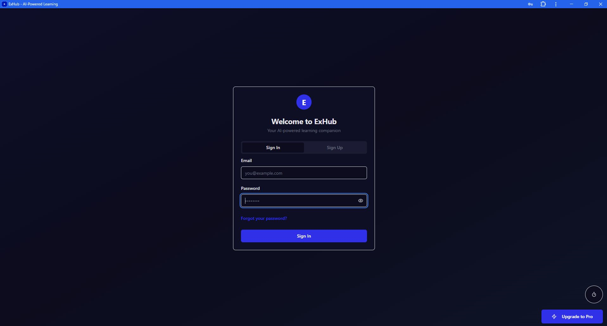
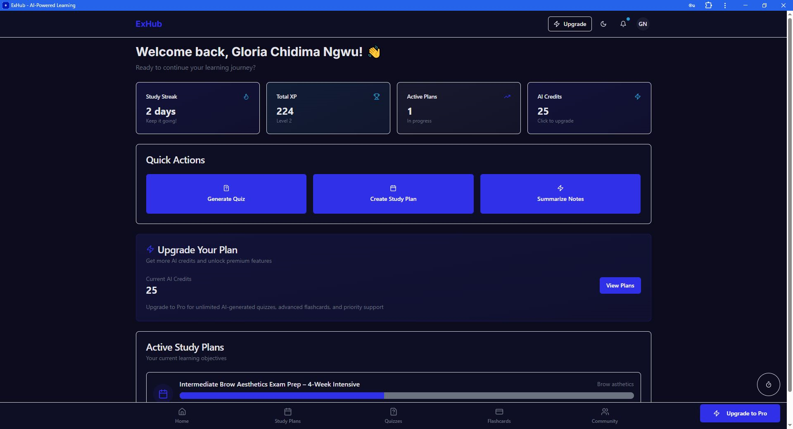
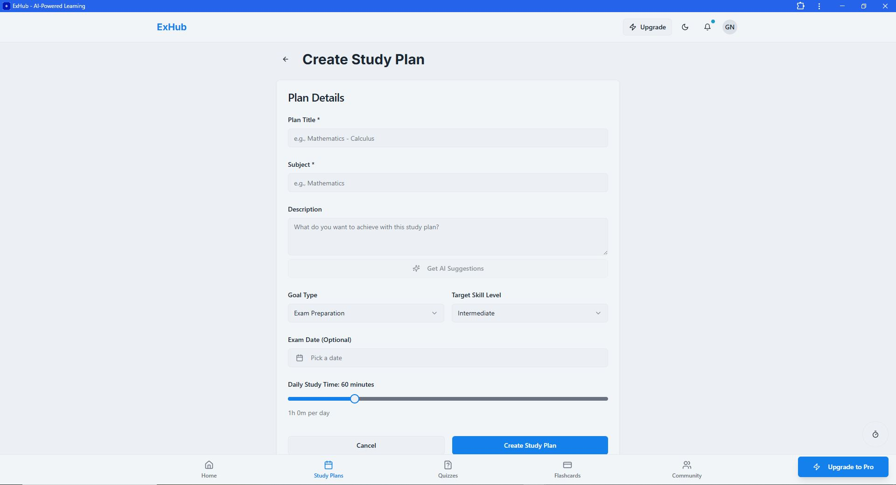
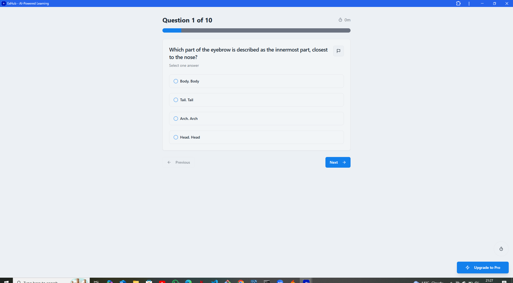
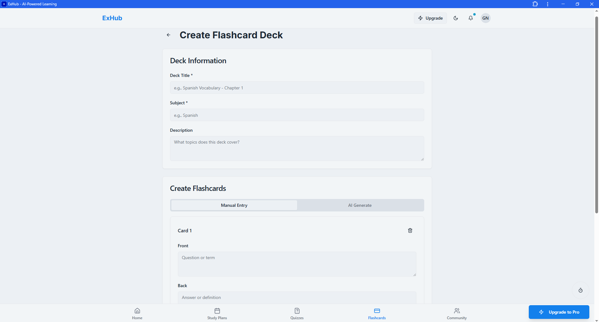
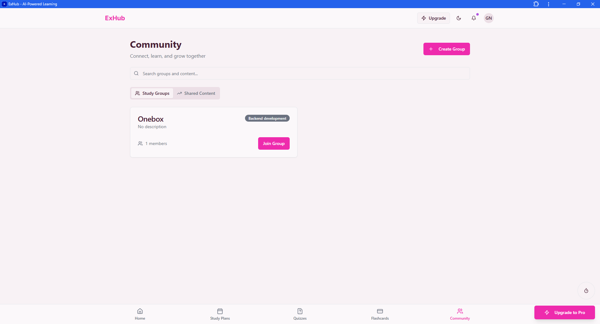
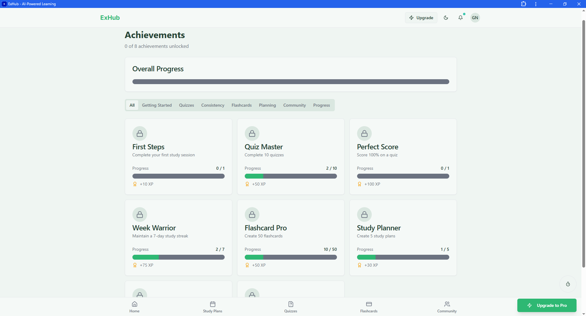

# ExHub - AI-Powered Learning Platform

**ExHub** is an AI-powered Progressive Web App that revolutionizes learning through personalized study plans, intelligent quizzes, flashcards, and community-driven education.

## Quick Start

```bash
# Install dependencies
npm install

# Set up environment variables
cp .env.example .env
# Add your Supabase credentials

# Start development server
npm run dev
```

Visit `[http://localhost:5173](https://build-buddy-app-589.lovable.app/?utm_source=lovable-editor)` to see the app running.

## 🔗 Quick Links

- **[Live App](https://build-buddy-app-589.lovable.app/)** - Try ExHub now
- **[Pitch Deck](https://exhub-ai-powered-learnin-ddlda4j.gamma.site/)** - Project overview and vision
- **[Video Demo](https://drive.google.com/file/d/1Yu5LXsx-fB_6uRn_-fTffiinxvZPX1uq/view?usp=drivesdk)** - See ExHub in action

## 📚 Documentation

Comprehensive documentation is available in the `/docs` folder:

- **[Setup Guide](docs/SETUP.md)** - Detailed installation and configuration
- **[Architecture](docs/ARCHITECTURE.md)** - Project structure and technical decisions  
- **[API Reference](docs/API.md)** - Edge function endpoints and usage
- **[Deployment](docs/DEPLOYMENT.md)** - Production deployment instructions
- **[Testing](tests/README.md)** - Testing strategy and guidelines

## 📋 Table of Contents

- [Problem Statement](#-problem-statement)
- [Approach](#-approach)
- [Features](#-features)
- [Screenshots](#-screenshots)
- [Tech Stack](#️-tech-stack)
- [Setup Instructions](#-setup-instructions)
- [Environment Configuration](#-environment-configuration)
- [Usage Guide](#-usage-guide)
- [Future Improvements](#-future-improvements)
- [Testing](#-testing)
- [Team Roles](#-team-roles)
- [Documentation](#-documentation)
- [Deployment](#-deployment)
- [License](#-license)

## 🎯 Problem Statement

Modern learners face several critical challenges:

- **Fragmented Resources**: Study materials are scattered across multiple platforms, making it difficult to maintain organized learning paths
- **Lack of Personalization**: Traditional study methods don't adapt to individual learning styles, preferences, or pace
- **Inefficient Time Management**: Students struggle to create effective study schedules that align with their goals and available time
- **Limited Engagement**: Conventional learning lacks gamification and motivation systems to maintain consistency
- **Isolation in Learning**: Self-directed learners miss out on collaborative learning and peer support
- **Content Overload**: Lengthy documents and materials are time-consuming to digest without proper summarization tools

## 💡 Approach

ExHub addresses these challenges through an integrated AI-powered solution:

### Personalization Engine
- Assesses individual learning styles (visual, auditory, kinesthetic)
- Adapts content difficulty based on user performance
- Creates customized study schedules aligned with personal goals

### AI-Powered Content Generation
- **Study Plans**: Generates personalized learning schedules using Lovable AI Gateway
- **Quiz Generation**: Automatically creates practice questions from uploaded materials
- **Smart Summarization**: Condenses lengthy documents into digestible summaries
- **Flashcard Creation**: Produces spaced-repetition optimized flashcards from content

### Gamification & Motivation
- XP points and achievement system for consistent engagement
- Study streak tracking to build sustainable habits
- Leaderboards for friendly competition

### Community Learning
- Study groups for collaborative learning
- Content sharing and peer support
- Expert Q&A for guidance

## ✨ Features

- **AI Study Plans**: Personalized schedules with Lovable AI
- **Smart Quizzes**: AI-generated questions from your materials
- **Flashcards**: Spaced repetition with AI generation
- **Document Summarization**: Convert lengthy PDFs and documents into concise summaries
- **Gamification**: XP, achievements, and study streaks
- **Community**: Study groups and content sharing
- **Progress Analytics**: Detailed insights into learning patterns
- **PWA Support**: Install as mobile app with offline capabilities

## 📸 Screenshots

### Authentication & Onboarding Flow

*Clean and intuitive login/signup interface with social authentication options*


*Personalized onboarding experience to understand user preferences*

### Dashboard & Study Management

*Centralized hub showing study plans, progress, achievements, and quick actions*


*AI-powered study plan generator with customizable goals and schedules*

### AI-Powered Learning Tools

*Generate intelligent quizzes from any document or text content*


*Interactive quiz interface with progress tracking and instant feedback*


*Spaced repetition flashcard system with smooth card flip animations*

### Community & Gamification

*Collaborative learning through study groups and shared resources*


*Gamified experience with XP, badges, and study streak tracking*

## 🛠️ Tech Stack

**Frontend:**
- React 18 + TypeScript + Vite
- Tailwind CSS + Shadcn/ui components
- React Router for navigation
- TanStack Query for data fetching

**Backend:**
- Supabase (PostgreSQL database, authentication, storage)
- Supabase Edge Functions (serverless API endpoints)
- Lovable AI Gateway (Gemini + GPT-5 integration)

**AI Integration:**
- OpenAI Whisper for audio transcription
- Lovable AI for content generation, summarization, and quiz creation

**DevOps:**
- Vite PWA for Progressive Web App features
- Service Workers for offline functionality

## 🚀 Setup Instructions

### Prerequisites

- Node.js 18+ and npm
- Supabase account
- Lovable account (for AI features)

### Step 1: Clone the Repository

```bash
git clone <YOUR_GIT_URL>
cd exhub
```

### Step 2: Install Dependencies

```bash
npm install
```

### Step 3: Set Up Supabase

1. Create a new project at [supabase.com](https://supabase.com)
2. Apply database migrations:
   ```bash
   npx supabase db push
   ```
3. Deploy Edge Functions:
   ```bash
   npx supabase functions deploy
   ```

### Step 4: Configure Environment Variables

Create a `.env` file in the root directory (see [Environment Configuration](#-environment-configuration))

### Step 5: Run Development Server

```bash
npm run dev
```

Visit `http://localhost:8080`

## 🔧 Environment Configuration

Create a `.env` file in the root directory with the following variables:

```env
# Supabase Configuration
VITE_SUPABASE_URL=your_supabase_project_url
VITE_SUPABASE_ANON_KEY=your_supabase_anon_key

# Optional: Only needed if deploying edge functions locally
SUPABASE_SERVICE_ROLE_KEY=your_service_role_key
```

### How to Get These Values

1. **Supabase URL & Anon Key**:
   - Go to your Supabase project dashboard
   - Navigate to Settings → API
   - Copy the "Project URL" and "anon/public" key

2. **Lovable AI Gateway**:
   - The AI features use Lovable Cloud's built-in AI gateway
   - No additional API keys needed for basic AI functionality
   - Lovable AI is automatically configured when using Lovable Cloud

### Edge Function Environment Variables

Edge functions require additional secrets set in Supabase:

```bash
# Set Lovable AI API key (if using custom key)
npx supabase secrets set LOVABLE_API_KEY=your_lovable_api_key

# Set OpenAI API key (for Whisper transcription)
npx supabase secrets set OPENAI_API_KEY=your_openai_api_key
```

## 📖 Usage Guide

### 1. Getting Started

**Create an Account:**
1. Open ExHub and click "Sign Up"
2. Enter your email and password or use social login
3. Complete the onboarding flow:
   - Learning style assessment
   - Set your goals
   - Configure notification preferences

### 2. Creating a Study Plan

1. Navigate to "Study Plans" from the bottom navigation
2. Click "Create New Plan"
3. Enter:
   - Subject/topic
   - Goal type (exam prep, skill development, etc.)
   - Available study time per day
   - Target completion date
4. Review the AI-generated plan
5. Start your first study session

### 3. Generating Quizzes

1. Go to "Quizzes" section
2. Click "Generate Quiz"
3. Choose input method:
   - Upload a document (PDF, DOCX)
   - Paste text content
   - Select a topic
4. Set difficulty level and question count
5. Review and take the quiz

### 4. Creating Flashcards

1. Navigate to "Flashcards"
2. Click "Create Deck"
3. Options:
   - Manual entry (front/back)
   - AI generation from content
   - Bulk import from CSV
4. Study using spaced repetition

### 5. Summarizing Documents

1. Go to "Summarize" section
2. Upload a PDF or text document
3. Click "Summarize"
4. Review the AI-generated summary
5. Save or share the summary

### 6. Joining the Community

1. Visit "Community" tab
2. Browse study groups by subject
3. Join relevant groups
4. Share resources and participate in discussions

## 🔮 Future Improvements

ExHub is continuously evolving. Here are planned enhancements for upcoming releases:

### Short-Term Roadmap (Q1 2025)

#### Enhanced AI Features
- **AI Tutor Chat**: Real-time conversational AI assistant for instant help with study materials
- **Voice Learning**: Text-to-speech for flashcards and summaries to support auditory learners
- **Advanced Analytics**: Predictive insights on optimal study times and personalized recommendations

#### Learning Experience
- **Study Rooms**: Virtual co-working spaces with video/audio for real-time collaboration
- **Adaptive Difficulty**: Dynamic quiz difficulty adjustment based on performance patterns
- **Learning Paths**: Pre-built curriculum tracks for popular certifications and skills

#### Community Features
- **Live Study Sessions**: Scheduled group study sessions with screen sharing
- **Mentorship Program**: Connect experienced learners with beginners
- **Content Marketplace**: Allow creators to share and monetize premium study materials

### Medium-Term Roadmap (Q2-Q3 2025)

#### Platform Expansion
- **Mobile Native Apps**: iOS and Android native applications with enhanced performance
- **Offline AI**: Edge computing for basic AI features without internet connection
- **Multi-language Support**: Interface and content generation in 10+ languages

#### Integration & Ecosystem
- **LMS Integration**: Connect with Canvas, Moodle, Blackboard for seamless content sync
- **Calendar Apps**: Deep integration with Google Calendar, Outlook, Apple Calendar
- **Note-Taking Apps**: Two-way sync with Notion, Evernote, OneNote
- **Browser Extensions**: Quick capture of web content for quiz/flashcard generation

#### Accessibility & Inclusivity
- **Screen Reader Optimization**: Full WCAG 2.1 AA compliance
- **Dyslexia-Friendly Mode**: Custom fonts, spacing, and reading assistance
- **Keyboard Navigation**: Complete app control without mouse/touch

### Long-Term Vision (Q4 2025+)

#### Advanced Personalization
- **Neuroscience-Based Learning**: Incorporate cognitive science research for optimal retention
- **Biometric Integration**: Study pattern optimization based on focus levels (via wearables)
- **Learning Style Evolution**: AI that adapts as user learning preferences change over time

#### Enterprise & Education
- **Schools Dashboard**: Teacher portal for class management and progress tracking
- **Corporate Training**: Custom solutions for employee onboarding and skill development
- **API Access**: Developer API for third-party integrations and custom applications

#### Research & Development
- **Learning Effectiveness Research**: Partner with educational institutions for impact studies
- **Open Source Contributions**: Release core learning algorithms for community improvement
- **AI Model Fine-Tuning**: Custom models trained specifically on educational content

### Community-Requested Features
- **Dark Mode Scheduling**: Automatic theme switching based on time of day
- **Pomodoro Timer Integration**: Built-in focus timer with study plan synchronization
- **Achievement Sharing**: Social media integration for celebrating learning milestones
- **Custom Theme Builder**: Allow users to create and share custom color schemes
- **Study Music Integration**: Curated focus music from Spotify/Apple Music
- **Handwriting Recognition**: Upload handwritten notes for AI processing
- **Citation Manager**: Automatic bibliography generation for research projects

**Want to suggest a feature?** Open an issue or join our [Discord community](https://discord.com/channels/1119885301872070706/1280461670979993613) to share your ideas!

## 🧪 Testing

### Basic Functionality Tests

**1. Authentication Test:**
```bash
# Test user registration and login
1. Open the app
2. Click "Sign Up"
3. Create a test account
4. Verify email confirmation
5. Log in with credentials
```

**2. Study Plan Generation Test:**
```bash
1. Navigate to Study Plans
2. Click "Create New Plan"
3. Fill in: Subject="JavaScript", Goal="Exam Prep", Time="2 hours/day"
4. Verify AI generates a structured plan
5. Check that sessions are properly scheduled
```

**3. Quiz Generation Test:**
```bash
1. Go to Quizzes → Generate Quiz
2. Paste sample text: "React is a JavaScript library for building user interfaces"
3. Set difficulty to "Medium" and 5 questions
4. Click "Generate"
5. Verify questions are relevant to the content
```

**4. Document Summarization Test:**
```bash
1. Navigate to Summarize page
2. Upload a sample PDF document
3. Click "Summarize"
4. Verify summary is generated successfully
5. Check that summary captures key points
```

**5. Flashcard Creation Test:**
```bash
1. Go to Flashcards → Create Deck
2. Add 3 manual cards with front/back content
3. Save the deck
4. Enter study mode
5. Verify card flip animation and rating system work
```

**6. PWA Installation Test:**
```bash
1. Open app in Chrome/Edge
2. Look for "Install App" prompt
3. Click install
4. Verify app opens as standalone application
5. Test offline functionality by disabling network
```

### Edge Function Tests

Test individual edge functions using curl or Supabase dashboard:

```bash
# Test summarize-content function
curl -X POST 'https://your-project.supabase.co/functions/v1/summarize-content' \
  -H 'Authorization: Bearer YOUR_ANON_KEY' \
  -H 'Content-Type: application/json' \
  -d '{"text": "Sample content to summarize"}'
```

## 👥 Team Roles

ExHub was built by a dedicated team of developers, designers, and education specialists:

### Development Team

**Frontend Development**
- **Lead Frontend Engineer**: React architecture, component library, PWA implementation
- **UI/UX Developer**: Design system, responsive layouts, accessibility features
- **State Management Specialist**: TanStack Query integration, optimistic updates, caching strategies

**Backend Development**
- **Backend Lead**: Supabase architecture, database schema design, RLS policies
- **Edge Functions Engineer**: Serverless API endpoints, AI integration, third-party services
- **DevOps Engineer**: CI/CD pipelines, deployment automation, monitoring setup

**AI & Data**
- **AI Integration Specialist**: OpenAI integration, prompt engineering, content generation optimization
- **Data Analyst**: Learning analytics, performance tracking, usage insights
- **ML Engineer**: Spaced repetition algorithms, adaptive difficulty systems

### Design & Product

**Product Team**
- **Product Manager**: Feature prioritization, roadmap planning, stakeholder communication
- **UX Researcher**: User testing, feedback analysis, usability improvements
- **Product Designer**: User flows, wireframes, prototype creation

**Visual Design**
- **Lead Designer**: Brand identity, color system, typography, icon design
- **Motion Designer**: Animations, micro-interactions, loading states

### Quality & Documentation

**QA Team**
- **QA Lead**: Test strategy, manual testing, bug triage
- **Test Automation Engineer**: E2E tests, integration tests, CI/CD test automation

**Technical Writing**
- **Documentation Lead**: API documentation, setup guides, architecture docs
- **Content Writer**: User guides, tooltips, help articles

### Education & Community

**Educational Content**
- **Learning Experience Designer**: Pedagogical approach, onboarding flow, gamification strategy
- **Content Strategist**: Study material curation, community guidelines

**Community Management**
- **Community Manager**: User support, Discord moderation, feedback collection
- **Developer Advocate**: Open source contributions, developer relations

### Project Leadership

**Executive Team**
- **Project Lead**: Overall vision, strategic direction, resource allocation
- **Tech Lead**: Technical architecture decisions, code review, best practices
- **Design Lead**: Design system oversight, brand consistency, design review

## 🔗 Additional Resources

- [Lovable Docs](https://docs.lovable.dev) - Lovable platform documentation
- [Supabase Docs](https://supabase.com/docs) - Supabase backend documentation

## 🚀 Deployment

### Deploy to Lovable Cloud

1. Click "Publish" in [Lovable](https://lovable.dev/projects/791efb3c-3dd8-4600-b77f-561f4949be23)
2. Verify environment variables are set
3. Test the deployed application
4. Optionally configure a custom domain

### Manual Deployment

For detailed deployment instructions including custom domains, rollback procedures, and monitoring, see [docs/DEPLOYMENT.md](docs/DEPLOYMENT.md)

## 📝 License

MIT License

## 🤝 Contributing

Contributions are welcome! Please feel free to submit issues or pull requests.

## 📧 Support

For support and questions:
- Check the [Help section](https://docs.lovable.dev)
- Join our [Discord community](https://discord.com/channels/1119885301872070706/1280461670979993613)

---

Built with ❤️ using [Lovable](https://lovable.dev)
